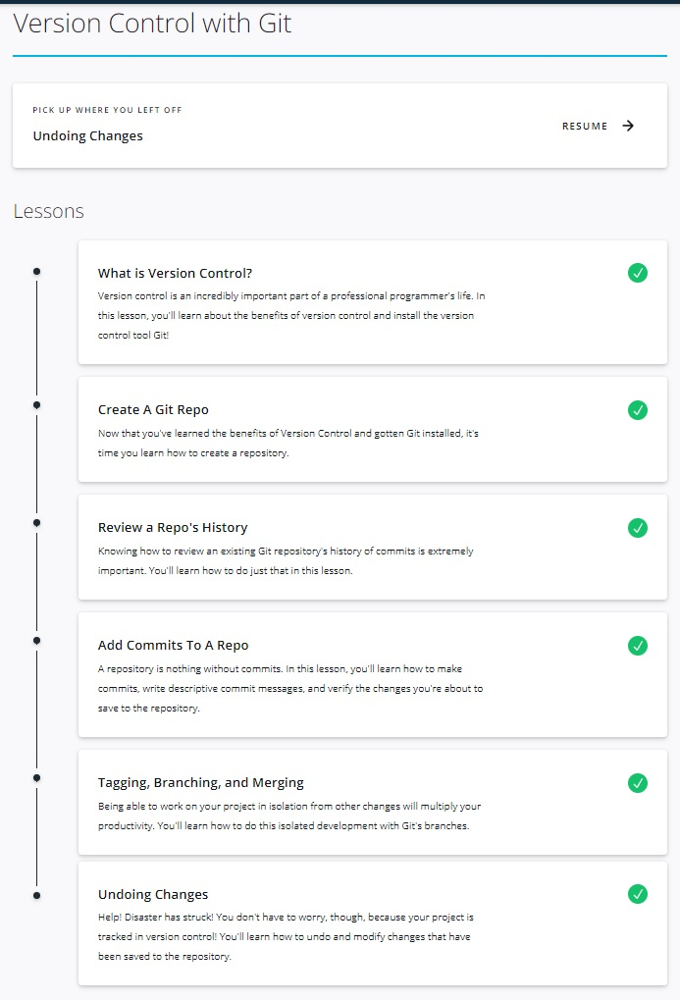
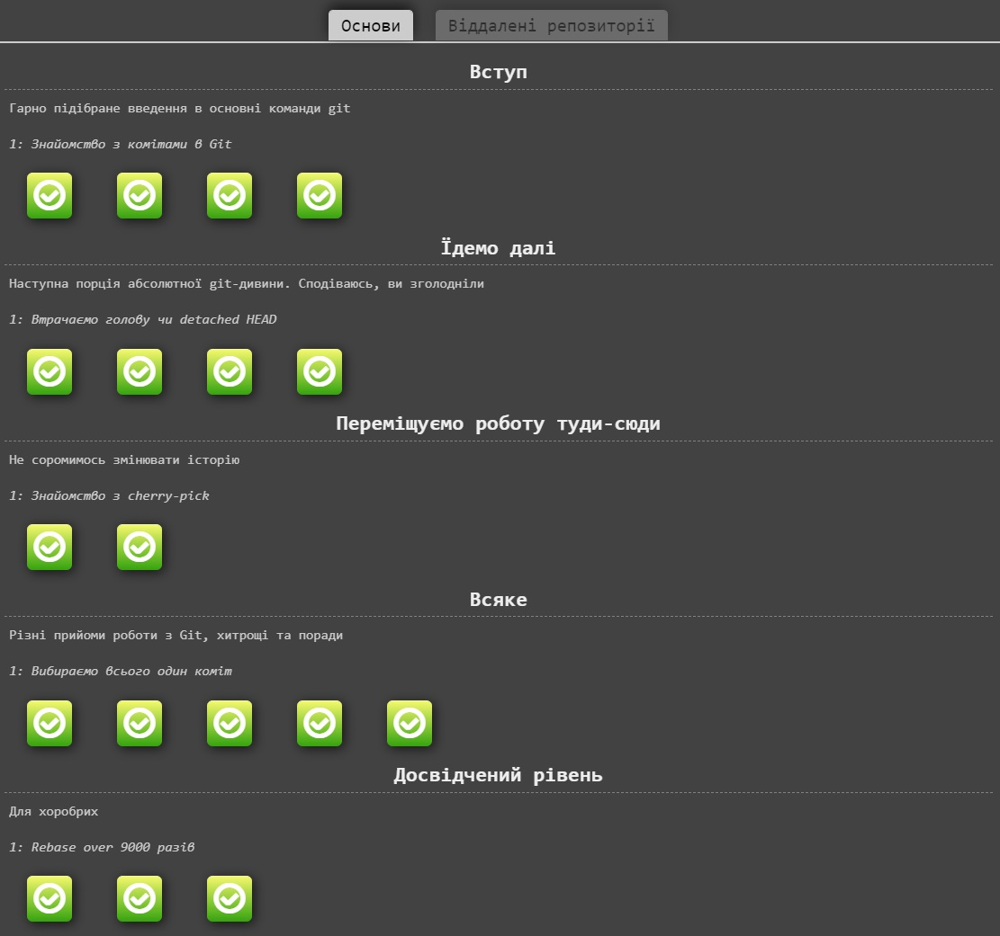
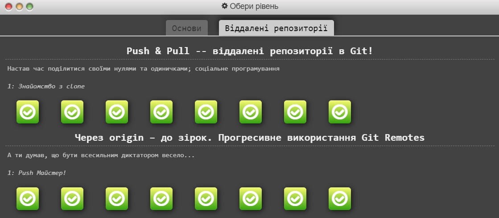

## Hi, I'm Artem
These are my first steps, if not in programming, then in Git for sure :)

### First step:
course __"Version Control with Git"__ on
> learn.udacity.com

<details><summary>Screenshot</summary>



</details>

Previously I only knew 'git init', 'git commit -m "..."' and 'git push', 
so now I found out about 'git log', 'git tag', 'git branch', 'git merge' and, 
of course, 'git status'.

---
### Second step:

> learngitbranching.js.org

<details><summary>Basic</summary>



</details>

<details><summary>Advanced</summary>



</details>

Here repeated everything and deepened knowledge. Learned about 'git rebase',
'git cherry-pick', 'git clone', 'git fetch' and other things.
It was especially interesting:
```
git push origin :<branch-name>
git fetch origin :<branch-name>
```
